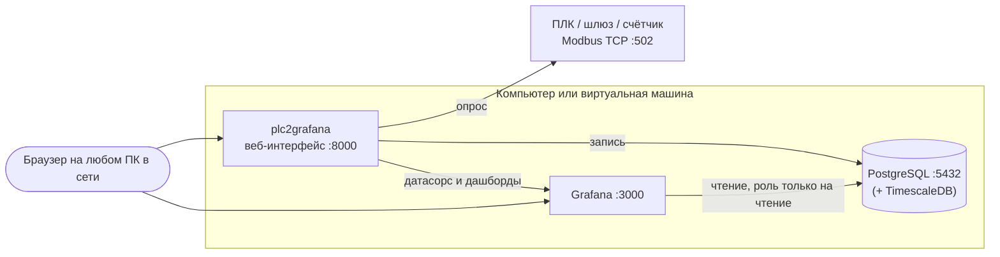

# Установка plc2grafana

Подробное руководство: как развернуть проект с GitHub на рабочем компьютере
с Windows, на виртуальной машине с Linux или в Docker — со всеми компонентами,
автозапуском, доступом по сети, обновлением и резервным копированием.

Если нужно просто попробовать — хватит [раздела 3](#3-windows-пк) (Windows)
или [раздела 4](#4-linux-виртуальная-машина) (Linux, одна команда). Остальное —
справочник на случай, когда что-то пошло не так или пора выводить в работу.

**Содержание**

1. [Из чего состоит система](#1-из-чего-состоит-система)
2. [Какой способ выбрать](#2-какой-способ-выбрать)
3. [Windows: ПК](#3-windows-пк)
4. [Linux: виртуальная машина](#4-linux-виртуальная-машина)
5. [Docker](#5-docker)
6. [Первое устройство](#6-первое-устройство)
7. [Безопасность](#7-безопасность)
8. [Резервное копирование и перенос](#8-резервное-копирование-и-перенос)
9. [Проверка установки](#9-проверка-установки)
10. [Если что-то не работает](#10-если-что-то-не-работает)
11. [Удаление](#11-удаление)
12. [Справочник](#12-справочник)

---

## 1. Из чего состоит система



| Компонент | Что делает | Откуда берётся |
|---|---|---|
| **plc2grafana** | веб-интерфейс, опрос устройств, генерация дашбордов | этот репозиторий, Python 3.11+ |
| **PostgreSQL** 14+ | хранит историю значений | ставится отдельно (Windows, Linux) или контейнером (Docker) |
| **TimescaleDB** | сжатие, агрегаты, политика хранения — *не обязательно* | расширение PostgreSQL; в Docker уже включено |
| **Grafana** 11.6 | дашборды | приложение скачивает portable-сборку само; в Docker — контейнер |
| **Эмулятор ПЛК** | проверить всё без железа | `tools/simulator.py` в репозитории |

Приложение само создаёт базу данных, роль для записи и отдельную роль
`grafana_ro` только на чтение, само скачивает и запускает Grafana и само
настраивает ей датасорс и дашборды. Руками ставятся только Python и
PostgreSQL — и то на Linux это делает скрипт.

---

## 2. Какой способ выбрать

| | Windows ПК | Linux VM (скрипт) | Docker |
|---|---|---|---|
| Для чего | попробовать, рабочее место инженера | постоянная работа для цеха | если Docker уже есть в инфраструктуре |
| Что поставить руками | Python, Git, PostgreSQL | ничего | Docker |
| Команд до результата | ~5 | 1 | 3 |
| Автозапуск | Планировщик заданий (п. 3.8) | служба systemd — сразу | `restart: unless-stopped` — сразу |
| TimescaleDB | по желанию | по желанию (п. 4.8) | включён |
| Modbus RTU (RS-485) | COM-порт напрямую | `/dev/ttyUSB0`, права уже выданы | пробросить устройство в контейнер |

**Рекомендация.** Для постоянной работы — Linux-виртуалка и скрипт: одна
команда, служба поднимается после перезагрузки сама, обновление — та же
команда. Windows — для знакомства и для рабочего места, где интерфейс нужен
одному человеку.

### Требования к ресурсам

| | Минимум | Рекомендуется |
|---|---|---|
| CPU | 1 ядро | 2 ядра |
| ОЗУ | 2 ГБ | 4 ГБ |
| Диск под систему и программы | 5 ГБ | 10 ГБ |
| Диск под историю | см. ниже | |
| Сеть | доступ к ПЛК по TCP 502 | + доступ пользователей к портам 8000 и 3000 |

Grafana скачивается один раз (~250 МБ) и в распакованном виде занимает
~1.7 ГБ. Интернет нужен только для установки — дальше всё работает локально.

**Сколько места займёт история.** Одна строка значения на обычном PostgreSQL —
около 115 байт вместе с индексами (замерено на эмуляторе). Верхняя граница:

```
строк в сутки = число тегов × 86 400 / период опроса в секундах
```

| Тегов | Период | Строк в сутки (максимум) | Место в сутки | За 90 дней |
|---|---|---|---|---|
| 30 | 1 с | 2.6 млн | ~300 МБ | ~27 ГБ |
| 100 | 1 с | 8.6 млн | ~1 ГБ | ~90 ГБ |
| 100 | 5 с | 1.7 млн | ~200 МБ | ~18 ГБ |

Это худший случай: каждая точка пишется в базу. На деле объём в разы
меньше — мёртвая зона не пишет шум, а неизменные значения сохраняются раз в
минуту «сердцебиением». TimescaleDB дополнительно сжимает данные старше
7 дней, обычно в 10–20 раз. Срок хранения (90 дней по умолчанию) меняется на
странице **Система**.

---

## 3. Windows: ПК

Проверено на Windows 11. Команды — в PowerShell (Win+X → «Терминал»).

### 3.1 Python, Git и PostgreSQL

Проще всего через `winget` — он есть в Windows 10/11:

```powershell
winget install --id Python.Python.3.12 --exact
```

```powershell
winget install --id Git.Git --exact
```

```powershell
winget install --id PostgreSQL.PostgreSQL.16 --exact
```

После установки **закройте и откройте терминал заново**, чтобы подхватились
новые пути.

Если ставите вручную:

* **Python** — <https://www.python.org/downloads/>. На первом экране
  установщика отметьте **Add python.exe to PATH**.
* **PostgreSQL** — <https://www.postgresql.org/download/windows/>.
  Установщик спросит пароль пользователя `postgres` — **запишите его**, он
  понадобится один раз при настройке. Stack Builder в конце можно закрыть.
* **Git** — <https://git-scm.com/download/win> (нужен, чтобы скачать проект
  и потом обновлять его одной командой).

Проверка:

```powershell
python --version; git --version; Get-Service postgresql*
```

Должны быть Python 3.11 или новее и служба `postgresql-x64-16` в состоянии
`Running`.

### 3.2 Скачать проект

Выберите папку без кириллицы и пробелов в пути — так меньше сюрпризов:

```powershell
cd C:\
```

```powershell
git clone https://github.com/Jorkasys/plc2grafana.git
```

```powershell
cd C:\plc2grafana
```

Без Git: на странице репозитория **Code → Download ZIP**, распакуйте в
`C:\plc2grafana`. Обновлять тогда придётся тоже архивом.

### 3.3 Первый запуск

```powershell
.\start.bat
```

При первом запуске скрипт создаст виртуальное окружение `.venv`, поставит
зависимости (минуту-две) и откроет браузер на <http://localhost:8000>.
Окно терминала не закрывайте — это и есть работающее приложение. Остановка —
**Ctrl+C**.

### 3.4 Настройка базы данных

Первый экран — мастер настройки PostgreSQL:

| Поле | Значение |
|---|---|
| Адрес сервера | `127.0.0.1` |
| Порт | `5432` |
| Имя базы | `plc` (создастся сама) |
| Администратор PostgreSQL | `postgres` |
| Пароль администратора | тот, что задавали при установке PostgreSQL |

**Проверить подключение** → **Создать базу и запустить**. Приложение создаст
базу, роли и схему; пароли ролей сгенерирует само и сохранит в
`config\app.json`.

### 3.5 Grafana

Страница **Grafana** → **Установить Grafana**. Скачивание ~250 МБ, затем
**Запустить**. Дальше Grafana будет подниматься сама при каждом старте
приложения.

Смотреть дашборды можно без входа. Чтобы их править, войдите в Grafana
под `admin`; пароль сгенерирован и лежит в `config\app.json`:

```powershell
(Get-Content config\app.json -Encoding utf8 | ConvertFrom-Json).grafana.admin_password
```

### 3.6 Устройство

См. [раздел 6](#6-первое-устройство).

### 3.7 Доступ с других компьютеров

По умолчанию интерфейс открыт только на этом ПК. Чтобы зайти с других
компьютеров сети:

```powershell
.\start.bat --host 0.0.0.0
```

В терминале появятся адреса вида `По сети: http://192.168.1.50:8000`.
Grafana автоматически начнёт слушать там же — встроенные дашборды откроются
и на других компьютерах. Настройка запоминается: дальше достаточно
`.\start.bat`.

Windows при первом запуске спросит разрешение для Python и Grafana в
брандмауэре — разрешите для **частных сетей**. Если окно не появилось или
вы его закрыли, откройте порты вручную (терминал от имени администратора):

```powershell
New-NetFirewallRule -DisplayName "plc2grafana" -Direction Inbound -Protocol TCP -LocalPort 8000,3000 -Action Allow -Profile Private,Domain
```

Важно: у интерфейса нет логина — см. [раздел 7](#7-безопасность).

### 3.8 Автозапуск при включении компьютера

Чтобы приложение работало без входа в систему и поднималось после
перезагрузки, зарегистрируйте его в Планировщике заданий. Терминал **от имени
администратора**, путь поправьте на свой:

```powershell
$dir = "C:\plc2grafana"
$action = New-ScheduledTaskAction -Execute "$dir\.venv\Scripts\python.exe" -Argument "run.py --no-browser --log-file runtime\logs\app.log" -WorkingDirectory $dir
$trigger = New-ScheduledTaskTrigger -AtStartup
$settings = New-ScheduledTaskSettingsSet -RestartCount 999 -RestartInterval (New-TimeSpan -Minutes 1) -ExecutionTimeLimit ([TimeSpan]::Zero) -StartWhenAvailable
$principal = New-ScheduledTaskPrincipal -UserId "SYSTEM" -LogonType ServiceAccount -RunLevel Highest
Register-ScheduledTask -TaskName "plc2grafana" -Action $action -Trigger $trigger -Settings $settings -Principal $principal
```

```powershell
Start-ScheduledTask -TaskName "plc2grafana"
```

Что важно в этих командах:

* `-ExecutionTimeLimit ([TimeSpan]::Zero)` — без этого Планировщик **убьёт
  задачу через 72 часа**;
* `-RestartCount` — перезапуск, если процесс упадёт;
* журнал пишется в `runtime\logs\app.log` (5 файлов по 5 МБ с ротацией);
* если PostgreSQL после перезагрузки поднимется позже приложения — не
  страшно: приложение повторяет подключение каждые 10 секунд;
* адрес и порт берутся из `config\app.json` — если в п. 3.7 вы уже
  запускали с `--host 0.0.0.0`, доступ по сети сохранится. Иначе добавьте
  `--host 0.0.0.0` в `-Argument`.

Перед регистрацией задачи остановите `start.bat` (Ctrl+C) — два экземпляра
не поделят порт 8000. Остановить задачу: `Stop-ScheduledTask plc2grafana`,
убрать: `Unregister-ScheduledTask plc2grafana -Confirm:$false`.

### 3.9 Обновление

```powershell
cd C:\plc2grafana
```

```powershell
git pull
```

```powershell
.\.venv\Scripts\python.exe -m pip install -r requirements.txt
```

Затем перезапустите приложение (Ctrl+C и `.\start.bat`, или
`Stop-ScheduledTask` / `Start-ScheduledTask`). Схема базы обновляется сама
при старте; настройки и данные сохраняются.

---

## 4. Linux: виртуальная машина

Поддерживаются **Ubuntu 22.04 / 24.04** и **Debian 12** (на других
дистрибутивах — [Docker](#5-docker)).

### 4.1 Виртуальная машина

Подойдёт любой гипервизор: Hyper-V, VirtualBox, VMware, Proxmox.

* **Образ:** Ubuntu Server 24.04 LTS, минимальная установка, с OpenSSH.
* **Ресурсы:** 2 vCPU, 4 ГБ ОЗУ, диск 40 ГБ (больше — если тегов много,
  см. [расчёт](#2-какой-способ-выбрать)).
* **Сеть** — здесь чаще всего ошибаются:

| Режим адаптера | Опрос ПЛК | Интерфейс с других ПК |
|---|---|---|
| NAT | работает (соединения исходящие) | только через проброс портов 8000 и 3000 |
| **Сетевой мост** (bridged / external switch) | работает | работает — у VM свой IP в сети |
| Две сетевые карты | одна в сеть АСУ ТП, вторая в офисную | рекомендуется для цеха |

Проще всего — **сетевой мост**: у виртуалки появится свой адрес в той же
сети, что и ПЛК. Если контроллеры в отдельной технологической сети, дайте
виртуалке второй адаптер в эту сеть — так офисная сеть и сеть АСУ ТП не
соединяются напрямую.

Проверьте с виртуалки, что контроллер доступен:

```bash
nc -zv 192.168.0.10 502
```

(`sudo apt install netcat-openbsd`, если команды нет.)

### 4.2 Установка одной командой

```bash
curl -fsSL https://raw.githubusercontent.com/Jorkasys/plc2grafana/main/deploy/install_linux.sh | sudo bash
```

Скрипт:

1. ставит Python, Git и PostgreSQL из репозиториев дистрибутива (в Ubuntu
   22.04 дополнительно Python 3.11 — системный там 3.10);
2. создаёт системного пользователя `plc2grafana` и даёт ему доступ к
   последовательным портам (для Modbus RTU);
3. клонирует проект в `/opt/plc2grafana` и создаёт виртуальное окружение;
4. генерирует пароль пользователя `postgres` и кладёт его в
   `/etc/plc2grafana.env` (права 640, root:plc2grafana);
5. скачивает Grafana;
6. регистрирует службу `plc2grafana` и запускает её. При первом старте
   приложение **само** создаёт базу, роли и схему — мастер в браузере не нужен.

В конце скрипт напечатает адреса, по которым открывается интерфейс:

```
Готово. Интерфейс:
  http://localhost:8000
  http://192.168.1.60:8000
```

Grafana — тот же адрес, порт **3000**. Войти в Grafana для правки дашбордов:
пользователь `admin`, пароль — в `/opt/plc2grafana/config/app.json`
(`grafana.admin_password`):

```bash
sudo /opt/plc2grafana/.venv/bin/python -c "import json; print(json.load(open('/opt/plc2grafana/config/app.json'))['grafana']['admin_password'])"
```

**Параметры скрипта:** `--port 8080` (другой порт интерфейса),
`--no-postgres` (база уже есть на другом сервере), `--no-grafana` (скачать
позже из интерфейса), `--branch`, `--prefix`. Установка из уже скачанного
репозитория: `sudo bash deploy/install_linux.sh --source .`

### 4.3 Брандмауэр

Если на виртуалке включён `ufw`, откройте порты **для своей сети**, а не для
всех:

```bash
sudo ufw allow from 192.168.1.0/24 to any port 8000 proto tcp
```

```bash
sudo ufw allow from 192.168.1.0/24 to any port 3000 proto tcp
```

Подставьте свою подсеть. Порт 5432 открывать не нужно — база доступна только
самой виртуалке.

### 4.4 Управление службой

```bash
sudo systemctl status plc2grafana      # состояние
```

```bash
sudo journalctl -u plc2grafana -f      # журнал в реальном времени
```

```bash
sudo systemctl restart plc2grafana     # перезапуск (вместе с Grafana)
```

Служба стартует после PostgreSQL и сети, перезапускается при падении и
останавливает Grafana вместе с собой.

### 4.5 Настройки службы

`/etc/plc2grafana.env` читается при каждом старте:

```bash
sudo nano /etc/plc2grafana.env
```

```bash
sudo systemctl restart plc2grafana
```

Все переменные перечислены в [справочнике](#переменные-окружения). Например,
сменить порт интерфейса — `PLC_WEB_PORT=8080`.

### 4.6 Обновление

Тот же скрипт: подтянет код из `main`, обновит зависимости и перезапустит
службу. Пароли, настройки и данные не трогает.

```bash
curl -fsSL https://raw.githubusercontent.com/Jorkasys/plc2grafana/main/deploy/install_linux.sh | sudo bash
```

### 4.7 Установка без скрипта

Если скрипт по каким-то причинам не подходит, те же шаги вручную:

```bash
sudo apt update && sudo apt install -y git python3 python3-venv postgresql
```

```bash
sudo git clone https://github.com/Jorkasys/plc2grafana.git /opt/plc2grafana
```

```bash
cd /opt/plc2grafana && sudo python3 -m venv .venv && sudo .venv/bin/pip install -r requirements.txt
```

```bash
sudo -u postgres psql -c "ALTER USER postgres PASSWORD 'придумайте-пароль'"
```

```bash
sudo .venv/bin/python run.py --host 0.0.0.0
```

Дальше — мастер настройки в браузере, как в п. 3.4. Для работы службой
используйте unit-файл, который создаёт `deploy/install_linux.sh` (раздел
«Служба systemd» в скрипте): он запускает приложение от отдельного
пользователя, а не от root.

### 4.8 TimescaleDB (по желанию)

Даёт сжатие истории в 10–20 раз, минутные и часовые агрегаты и политику
хранения на стороне базы. Проще всего поставить **до** первого запуска
приложения — тогда оно включит всё само. Команды из
[официальной инструкции](https://docs.timescale.com/self-hosted/latest/install/installation-linux/)
для Ubuntu/Debian:

```bash
sudo apt install -y gnupg postgresql-common apt-transport-https lsb-release wget
```

```bash
sudo /usr/share/postgresql-common/pgdg/apt.postgresql.org.sh
```

```bash
echo "deb https://packagecloud.io/timescale/timescaledb/ubuntu/ $(lsb_release -c -s) main" | sudo tee /etc/apt/sources.list.d/timescaledb.list
```

```bash
wget --quiet -O - https://packagecloud.io/timescale/timescaledb/gpgkey | sudo gpg --dearmor -o /etc/apt/trusted.gpg.d/timescaledb.gpg
```

```bash
sudo apt update && sudo apt install -y timescaledb-2-postgresql-16 && sudo timescaledb-tune --quiet --yes && sudo systemctl restart postgresql
```

Для Debian замените `ubuntu` на `debian` в строке репозитория; `16` — версия
вашего PostgreSQL (`psql --version`).

Если приложение уже работало на обычном PostgreSQL — включите расширение и
примените схему от имени владельца таблиц, затем перезапустите службу:

```bash
sudo -u postgres psql -d plc -c "CREATE EXTENSION IF NOT EXISTS timescaledb"
```

```bash
sudo -u postgres psql -d plc -c "SET ROLE plc" -f /opt/plc2grafana/db/002_timescale.sql
```

```bash
sudo systemctl restart plc2grafana
```

На странице **Система** появится «TimescaleDB: включён».

---

## 5. Docker

Подходит для любой ОС с Docker: Linux-сервер, Windows с Docker Desktop.
Вместо системного PostgreSQL здесь контейнер TimescaleDB, вместо скачанной
Grafana — контейнер Grafana. База настраивается сама.

### 5.1 Docker

* **Linux:**

  ```bash
  curl -fsSL https://get.docker.com | sudo sh
  ```

  ```bash
  sudo usermod -aG docker $USER
  ```

  Затем перелогиньтесь, чтобы группа применилась.
* **Windows / macOS:** [Docker Desktop](https://www.docker.com/products/docker-desktop/).

### 5.2 Запуск

```bash
git clone https://github.com/Jorkasys/plc2grafana.git
```

```bash
cd plc2grafana && cp .env.example .env
```

Откройте `.env` и задайте `POSTGRES_ADMIN_PASSWORD` — пароль
суперпользователя базы в контейнере. Остальное можно не трогать.

```bash
docker compose up -d --build
```

Через минуту-две:

* интерфейс — `http://<адрес машины>:8000`;
* Grafana — `http://<адрес машины>:3000` (вход для правки: `admin` и пароль
  `GF_SECURITY_ADMIN_PASSWORD` из `.env`, по умолчанию `admin` — смените).

Проверка состояния: `docker compose ps`, журналы: `docker compose logs -f app`.

### 5.3 Адрес устройства из контейнера

В мастере подключения указывайте **IP контроллера как обычно** — контейнер
выходит в сеть через хост. Особый случай — эмулятор или шлюз, запущенный на
*самой* машине с Docker: для него адрес `host.docker.internal`, а не
`127.0.0.1` (внутри контейнера `127.0.0.1` — это сам контейнер).

### 5.4 Что где хранится

| Том | Что внутри |
|---|---|
| `timescale-data` | база данных — **история значений** |
| `app-config` | `app.json`: настройки и сгенерированные пароли ролей |
| `app-runtime` | сгенерированные дашборды и provisioning для Grafana |
| `grafana-data` | пользователи Grafana и ручные правки дашбордов |

PostgreSQL виден с хоста только на `127.0.0.1:5433` (не 5432, чтобы не
столкнуться с уже установленным PostgreSQL).

### 5.5 Обновление и остановка

```bash
git pull && docker compose up -d --build
```

```bash
docker compose down        # остановить, данные сохраняются
```

`docker compose down -v` удалит и тома — **вместе со всей историей**.

### 5.6 Modbus RTU в Docker

Раскомментируйте в `docker-compose.yml` блок `devices` у сервиса `app`
и укажите свой порт (`/dev/ttyUSB0`). На Windows проброс COM-портов в Docker
Desktop не поддерживается — для RTU используйте установку без Docker.

---

## 6. Первое устройство

Одинаково для всех способов установки.

### Без контроллера — эмулятор

На той же машине, где приложение:

```bash
python tools/simulator.py --port 5020
```

(Windows: `.\.venv\Scripts\python.exe tools\simulator.py --port 5020`,
Linux после установки скриптом: `python3 /opt/plc2grafana/tools/simulator.py --port 5020` —
эмулятору не нужны зависимости.)

В интерфейсе: **Подключение** → адрес `127.0.0.1` (в Docker —
`host.docker.internal`), порт `5020` → **Проверить связь** → **Дальше** →
начальный адрес `100`, количество `20` → **Сканировать** → **Дальше** →
**Сохранить и запустить опрос**. Через пару секунд значения появятся на
странице **Мониторинг**; на странице **Grafana** — кнопка «Сгенерировать
дашборды».

### Настоящий контроллер

1. Проверьте сеть с машины, где работает приложение:
   Windows `Test-NetConnection 192.168.0.10 -Port 502`,
   Linux `nc -zv 192.168.0.10 502`.
2. На контроллере должен быть включён Modbus TCP-сервер. У Siemens
   S7-1200/1500 это блок **MB_SERVER** в программе (регистры отображаются на
   DB через параметр `MB_HOLD_REG`); у S7-300/400 — коммуникационный модуль
   или шлюз Profinet → Modbus TCP.
3. Unit ID чаще всего `1`; у шлюзов бывает `0` или `255`.
4. Адреса в мастере — **адреса протокола с нуля**: `40001` → holding 0.

Подробнее о типах регистров и порядке слов — в
[README](README.md#если-значения-читаются-как-мусор).

---

## 7. Безопасность

**У веб-интерфейса нет авторизации.** Любой, кто откроет порт 8000, может
добавлять и удалять устройства. Grafana открыта для анонимного **просмотра**
(менять дашборды можно только после входа под `admin`). Поэтому:

* по умолчанию (`start.bat` без параметров) всё слушает только `127.0.0.1` —
  снаружи недоступно;
* открывая доступ по сети (`--host 0.0.0.0`, скрипт для Linux, Docker),
  ограничьте его брандмауэром **своей подсетью**: п. 3.7 и 4.3;
* не публикуйте порты 8000 и 3000 в интернет. Для удалённого доступа —
  VPN или обратный прокси с авторизацией перед приложением;
* разделяйте сети: виртуалка с двумя адаптерами (АСУ ТП и офис) лучше, чем
  открытый маршрут между ними;
* приложение только **читает** регистры контроллера — функций записи в ПЛК
  в интерфейсе нет.

Где лежат пароли:

| Файл | Что там | Кто должен читать |
|---|---|---|
| `config/app.json` | пароли роли приложения, `grafana_ro`, администратора Grafana и администратора PostgreSQL | только пользователь, от которого работает приложение |
| `/etc/plc2grafana.env` (Linux) | пароль `postgres` | root и служба (права 640) |
| `.env` (Docker) | пароль `postgres` и администратора Grafana | только администратор |

`config/app.json` и `.env` не попадают в git (`.gitignore`).

---

## 8. Резервное копирование и перенос

Сохранять нужно две вещи: **базу данных** и **`config/app.json`**.
Скачанную Grafana копировать незачем — приложение скачает её снова, а
дашборды сгенерирует кнопкой.

### Резервная копия базы

**Linux:**

```bash
sudo -u postgres pg_dump -Fc plc > plc_$(date +%F).dump
```

**Windows** (путь к `pg_dump` — из установки PostgreSQL):

```powershell
& "C:\Program Files\PostgreSQL\16\bin\pg_dump.exe" -h 127.0.0.1 -U postgres -Fc plc -f "plc_$(Get-Date -Format yyyy-MM-dd).dump"
```

**Docker:**

```bash
docker compose exec -T timescaledb pg_dump -U postgres -Fc plc > plc_$(date +%F).dump
```

Ежедневно на Linux — через cron (`sudo crontab -e`):

```
30 2 * * * sudo -u postgres pg_dump -Fc plc > /var/backups/plc_$(date +\%F).dump && find /var/backups -name 'plc_*.dump' -mtime +14 -delete
```

### Перенос на другую машину

1. На новой машине установите приложение любым способом и пройдите
   настройку базы — создадутся роли `plc` и `grafana_ro`.
2. Остановите приложение.
3. Восстановите копию поверх пустой базы:

   ```bash
   sudo -u postgres pg_restore --clean --if-exists -d plc plc_2026-10-08.dump
   ```

4. Запустите приложение. Устройства, теги, дерево двойника и история —
   на месте (всё это хранится в базе). Нажмите «Сгенерировать дашборды».

Если исходная база была на **TimescaleDB**, восстановление делается по
[процедуре Timescale](https://docs.timescale.com/self-hosted/latest/backup-and-restore/logical-backup/):
на новой машине тоже должен стоять TimescaleDB той же версии, а
`pg_restore` оборачивается вызовами подготовки:

```bash
sudo -u postgres psql -d plc -c "SELECT timescaledb_pre_restore()"
```

```bash
sudo -u postgres pg_restore --clean --if-exists -d plc plc_2026-10-08.dump
```

```bash
sudo -u postgres psql -d plc -c "SELECT timescaledb_post_restore()"
```

---

## 9. Проверка установки

Быстро — в браузере: страница **Система** показывает версию PostgreSQL,
состояние опроса и объём данных; индикаторы внизу слева — БД, опрос,
Grafana. Или из командной строки:

```bash
curl http://127.0.0.1:8000/api/status
```

**Сквозная проверка** всего стека — от опроса эмулятора до SQL-запроса через
датасорс Grafana:

```bash
python tools/simulator.py --port 5020 &
```

```bash
python tools/e2e_check.py --app http://127.0.0.1:8000 --plc-host 127.0.0.1 --cleanup
```

Скрипт создаёт тестовое устройство `e2e-plc` — запускайте его на стенде, а
не на рабочей базе (`--cleanup` удаляет устройство в конце). Для Docker
добавьте `--plc-host host.docker.internal --external-grafana`.

Эта же проверка автоматически выполняется в GitHub Actions на каждый пуш
(workflow `e2e`): установка скриптом на чистой Ubuntu с перезапуском службы
и запуск через `docker compose`.

---

## 10. Если что-то не работает

| Симптом | Причина | Что сделать |
|---|---|---|
| `start.bat`: «Не найден Python» | Python не в PATH | переустановите с галкой **Add python.exe to PATH** или `winget install Python.Python.3.12` |
| Мастер: «неверные имя пользователя или пароль» | пароль `postgres` не тот | пароль задавался при установке PostgreSQL; на Linux — в `/etc/plc2grafana.env` |
| Мастер: «PostgreSQL не отвечает» | служба остановлена | Windows: `Start-Service postgresql-x64-16`; Linux: `sudo systemctl start postgresql` |
| На странице Система «нет связи» с БД | база поднимается дольше приложения | подождите: приложение повторяет подключение каждые 10 с |
| Grafana: «порт 3000 уже занят другой Grafana» | на машине уже есть Grafana | остановите её или смените порт на странице **Система** |
| Дашборд пустой, когда интерфейс открыт с другого ПК | порт 3000 закрыт брандмауэром | откройте 3000 так же, как 8000 (п. 3.7, 4.3) |
| Дашборд пустой, а на самой машине работает | приложение запущено без `--host 0.0.0.0` | Grafana слушает там же, где интерфейс: перезапустите с `--host 0.0.0.0` |
| Дашбордов нет в списке | ещё не сгенерированы | **Grafana → Сгенерировать дашборды**; Grafana подхватывает файлы раз в 10 с |
| Устройство «нет связи» | сеть или Modbus | проверьте порт 502 (раздел 6), unit ID, включён ли Modbus-сервер на ПЛК |
| Из Docker не видно эмулятор | `127.0.0.1` внутри контейнера — сам контейнер | адрес `host.docker.internal` |
| Значения «мусорные» | порядок слов, адресация | таблица в [README](README.md#если-значения-читаются-как-мусор) |
| `git`: «detected dubious ownership» | диск без учёта владельцев (exFAT, сетевой) | `git config --global --add safe.directory <путь к папке>` |
| Linux: служба не стартует | — | `sudo journalctl -u plc2grafana -n 100` — там причина |
| Docker: в журнале `app` «автонастройка БД: … password authentication failed» | `POSTGRES_ADMIN_PASSWORD` в `.env` поменяли после первого запуска | образ PostgreSQL применяет пароль только при создании тома: верните прежний пароль или `docker compose down -v` (**удалит данные**) |

Журналы:

| Способ | Где |
|---|---|
| Windows, `start.bat` | окно терминала |
| Windows, Планировщик | `runtime\logs\app.log` |
| Linux | `journalctl -u plc2grafana` |
| Docker | `docker compose logs app` |
| Grafana (встроенная) | `runtime/grafana-logs/grafana.log`, последние строки — на странице **Grafana** |

---

## 11. Удаление

**Windows:**

```powershell
Unregister-ScheduledTask -TaskName plc2grafana -Confirm:$false
```

Затем удалите папку `C:\plc2grafana` и, если база больше не нужна:

```powershell
& "C:\Program Files\PostgreSQL\16\bin\psql.exe" -h 127.0.0.1 -U postgres -c "DROP DATABASE plc" -c "DROP ROLE plc" -c "DROP ROLE grafana_ro"
```

**Linux:**

```bash
sudo systemctl disable --now plc2grafana
```

```bash
sudo rm /etc/systemd/system/plc2grafana.service /etc/plc2grafana.env && sudo systemctl daemon-reload
```

```bash
sudo rm -rf /opt/plc2grafana && sudo userdel plc2grafana
```

```bash
sudo -u postgres psql -c "DROP DATABASE plc" -c "DROP ROLE plc" -c "DROP ROLE grafana_ro"
```

**Docker:**

```bash
docker compose down -v
```

`-v` удаляет тома вместе с историей.

---

## 12. Справочник

### Порты

| Порт | Кто слушает | Кому нужен |
|---|---|---|
| 8000 | веб-интерфейс и API | пользователям |
| 3000 | Grafana | пользователям (встроенные дашборды открываются с него) |
| 5432 | PostgreSQL | только самой машине |
| 5433 | PostgreSQL в Docker, только `127.0.0.1` | для `psql` и бэкапов с хоста |
| 502 | Modbus TCP **на контроллере** | исходящие соединения приложения |

### Файлы и каталоги

| Путь | Что это |
|---|---|
| `config/app.json` | настройки и пароли (создаётся при первом запуске) |
| `runtime/grafana/` | скачанная Grafana |
| `runtime/grafana-data/` | база самой Grafana: пользователи, ручные правки |
| `runtime/grafana-dashboards/` | сгенерированные дашборды `plc-*.json` |
| `runtime/grafana-provisioning/` | датасорс и провайдер дашбордов |
| `runtime/logs/app.log` | журнал при запуске с `--log-file` |
| `/etc/plc2grafana.env` | переменные службы (Linux) |
| `/opt/plc2grafana` | установка скриптом (Linux) |

### Ключи `run.py`

| Ключ | Что делает |
|---|---|
| `--host 0.0.0.0` | открыть интерфейс (и Grafana) для сети; запоминается |
| `--port 8080` | другой порт интерфейса; запоминается |
| `--no-browser` | не открывать браузер при старте |
| `--log-file runtime/logs/app.log` | дублировать журнал в файл с ротацией |
| `--install-grafana` | скачать Grafana и выйти |
| `--log-level debug` | подробный журнал |

`start.bat` передаёт ключи дальше: `.\start.bat --host 0.0.0.0 --port 8080`.

### Переменные окружения

Перекрывают `config/app.json` при каждом старте. На Linux задаются в
`/etc/plc2grafana.env`, в Docker — в `docker-compose.yml` / `.env`.

| Переменная | Значение |
|---|---|
| `PLC_WEB_HOST`, `PLC_WEB_PORT` | адрес и порт веб-интерфейса |
| `PLC_DB_HOST`, `PLC_DB_PORT`, `PLC_DB_NAME` | где база |
| `PLC_DB_USER`, `PLC_DB_PASSWORD` | роль приложения (по умолчанию создаётся сама) |
| `PLC_DB_ADMIN_USER`, `PLC_DB_ADMIN_PASSWORD` | администратор PostgreSQL для первичной настройки |
| `PLC_DB_AUTO_SETUP=1` | создать базу, роли и схему при старте без мастера |
| `PLC_GRAFANA_PORT` | порт Grafana |
| `PLC_GRAFANA_BIND` | где слушает встроенная Grafana (по умолчанию — как интерфейс) |
| `PLC_GRAFANA_AUTOSTART=0` | не запускать Grafana вместе с приложением |
| `PLC_GRAFANA_URL`, `PLC_GRAFANA_TOKEN` | использовать внешнюю Grafana вместо встроенной |
| `PLC_GRAFANA_PUBLIC_URL` | адрес Grafana для браузера, если она за обратным прокси |
