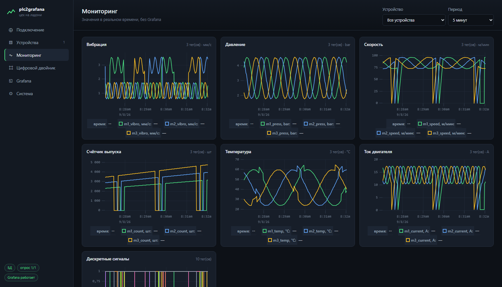
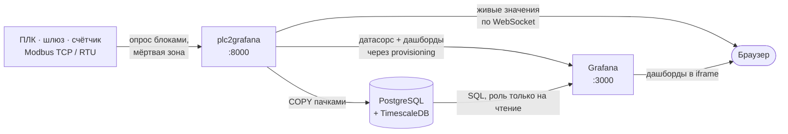
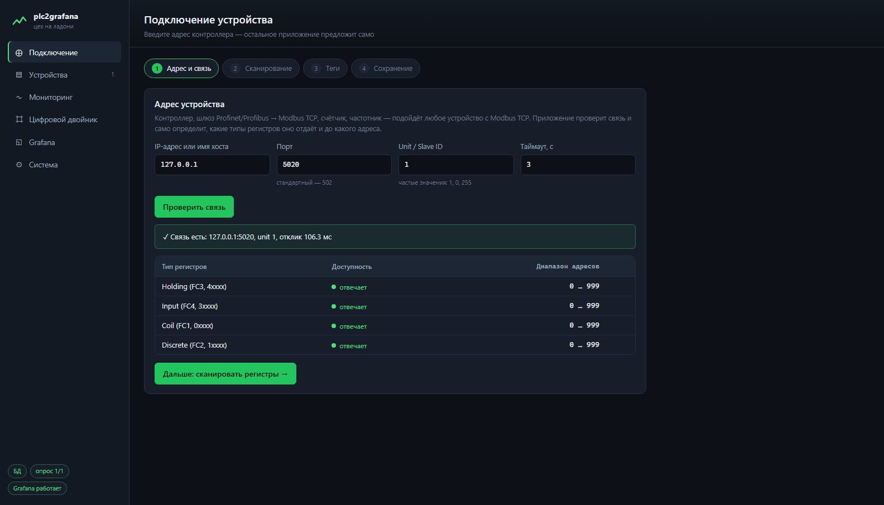
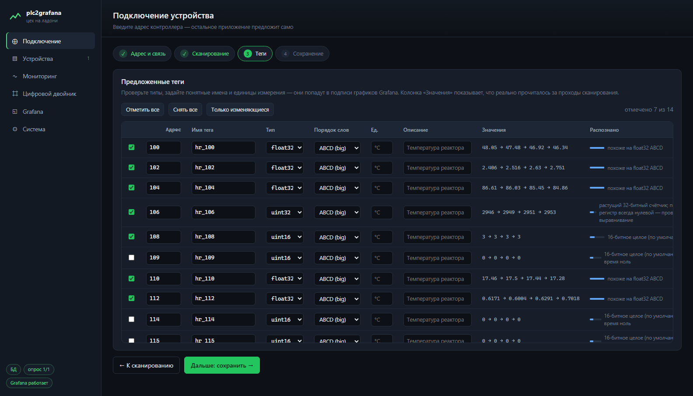
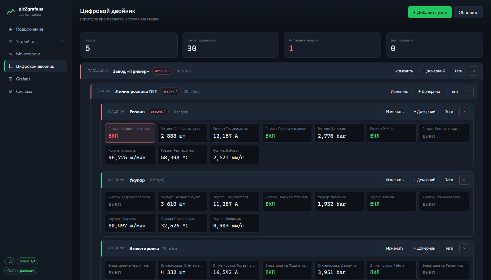
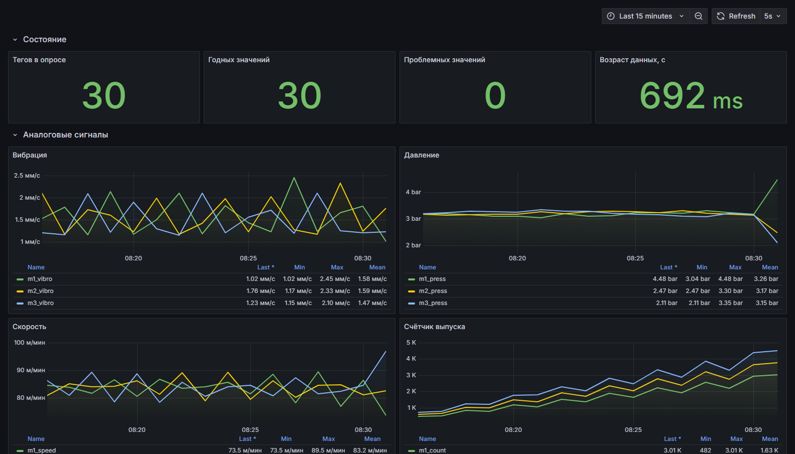

<h1 align="center">plc2grafana</h1>

<p align="center">
  Локальное веб-приложение для мониторинга производства.<br>
  Вводите IP контроллера — получаете живые графики, историю в PostgreSQL
  и готовые дашборды Grafana.
</p>

<p align="center">
  <a href="https://github.com/Jorkasys/plc2grafana/actions/workflows/ci.yml"></a>
  <a href="LICENSE"></a>
  
  
</p>

<p align="center">
  <b><a href="https://Jorkasys.github.io/plc2grafana/">🔎 Живое демо интерфейса</a></b>
  — работает прямо в браузере, без установки и без сервера.
</p>



---

## Как это работает



Приложение — единственный процесс, который вы запускаете. Оно само создаёт базу
и роли, само скачивает и запускает Grafana, само генерирует ей датасорс и
дашборды. Ставить в систему ничего не нужно.

---

## Четыре шага от IP до дашборда

### 1. Проверка связи

Вводите адрес — приложение подключается и выясняет, какие типы регистров
устройство отдаёт и до какого адреса работает его карта. Границу ищет
удвоением и половинным делением: 15–20 запросов вместо перебора 65 536 адресов.



### 2. Сканирование и автоопределение тегов

Приложение читает выбранный участок несколько раз подряд и по характеру
изменений предлагает типы данных: `float32` с нужным порядком слов, 32-битные
счётчики, слова состояния, текст. Незанятые ячейки помечает и не предлагает
добавлять. Рядом с каждым тегом — что реально прочиталось за проходы и
насколько приложение уверено в разборе.



Автоопределение честно признаётся, когда данных недостаточно: у 32-битного
значения за незанятой ячейкой появляется пометка «проверьте выравнивание»,
а адрес можно поправить прямо в таблице.

### 3. Цифровой двойник

Дерево «площадка → участок → линия → машина». К узлам привязываются теги —
и по этой же структуре строятся дашборды: линия получает свой дашборд, машина
свою группу панелей. Аварии подсвечиваются и считаются вверх по дереву.



### 4. Дашборды Grafana — сами

Одна кнопка: приложение скачивает portable-сборку Grafana в папку проекта,
запускает её дочерним процессом, создаёт датасорс на роль только для чтения и
генерирует дашборды по вашим тегам — с единицами измерения, границами,
лентой аварий и таблицей текущих значений.



---

## Что уже сделано за вас

| | |
|---|---|
| **Находит теги само** | читает окно регистров несколько раз и предлагает типы по характеру изменений |
| **Рисует дашборды само** | знает единицы, границы, роли тегов и место машины в иерархии |
| **Ставит Grafana само** | portable-сборка в папку проекта, датасорс и provisioning без единой настройки руками |
| **Группирует запросы** | соседние адреса склеиваются: 30 тегов читаются тремя запросами, а не тридцатью |
| **Мёртвая зона и «сердцебиение»** | не пишем в БД шум ±0.01 °C, но раз в N секунд фиксируем значение, чтобы график не рвался |
| **Качество значений** | GOOD / BAD_COMM / BAD_RANGE / BAD_DECODE / STALE — обрыв связи виден в данных, а не только в логе |
| **Переживает падение БД** | значения копятся в памяти и дописываются после восстановления, без дыр в графике |
| **Работает и без Grafana** | своя страница мониторинга с живыми графиками по WebSocket |
| **Эмулятор ПЛК в комплекте** | линия из трёх машин — проверить весь стек можно без доступа к железу |

---

## Быстрый старт

> 📘 **[Подробное руководство по установке — INSTALL.md](INSTALL.md)**: Windows,
> Linux-виртуалка одной командой, Docker, автозапуск, доступ по сети,
> безопасность, резервное копирование, диагностика.

Нужен **Python 3.11+** и **PostgreSQL** (обычный подойдёт; TimescaleDB, если он
есть, включится автоматически).

<table>
<tr><td><b>Windows</b></td><td><b>Linux / macOS</b></td></tr>
<tr valign="top"><td>

```bat
start.bat
```

Создаст `.venv`, поставит зависимости
и откроет браузер.

</td><td>

```bash
python3 -m venv .venv && . .venv/bin/activate
pip install -r requirements.txt
python run.py
```

</td></tr>
</table>

Дальше — <http://localhost:8000>. Первый экран спросит адрес PostgreSQL и
учётку администратора: приложение один раз создаст базу, роль для записи,
отдельную роль `grafana_ro` только на чтение и накатит схему. Пароли
генерируются и сохраняются в `config/app.json` — вводить их больше нигде
не нужно.

Ключи запуска: `--port 8080`, `--host 0.0.0.0` (доступ с других машин в сети —
Grafana откроется туда же), `--no-browser`, `--log-file`, `--reload`.

### Сервер на Linux — одной командой

Ubuntu 22.04+ / Debian 12+, например виртуалка для цеха:

```bash
curl -fsSL https://raw.githubusercontent.com/Jorkasys/plc2grafana/main/deploy/install_linux.sh | sudo bash
```

Поставит PostgreSQL и Python, развернёт приложение в `/opt/plc2grafana`,
скачает Grafana и запустит всё службой systemd. База настраивается сама,
после перезагрузки всё поднимается само. Повторный запуск — обновление.

### Docker

```bash
cp .env.example .env      # задайте POSTGRES_ADMIN_PASSWORD
docker compose up -d --build
```

TimescaleDB, приложение и Grafana — тремя контейнерами, база настраивается
сама. Подробности — [INSTALL.md, раздел 5](INSTALL.md#5-docker).

### Без контроллера

```bash
python tools/simulator.py --port 5020
```

Эмулятор Modbus TCP: одиночное устройство плюс производственная линия из трёх
машин. Подключайтесь к `127.0.0.1:5020` и сканируйте `holding` с адреса 100.

<details>
<summary>Карта регистров эмулятора</summary>

```
holding 0..1     float32  температура, 20…80 °C
holding 2..3     float32  давление, 1…9 bar
holding 4        int16    расход, сырое 0…27648
holding 10..11   uint32   счётчик выпуска
holding 20       uint16   слово состояния (бит 0 — насос, бит 3 — авария)
holding 200..207 string   имя рецепта
input   100      uint16   ток двигателя, ×0.1 A
coil/discrete 0..15       меняются по кругу

# линия: машина N занимает 20 регистров с адреса 100 + N * 20
+0..1   float32  температура, °C      +8      uint16  слово состояния
+2..3   float32  давление, bar                (бит0 работа, бит1 подача,
+4..5   float32  скорость, м/мин              бит3 авария, бит5 наладка)
+6..7   uint32   счётчик выпуска      +10..11 float32 ток двигателя, A
                                      +12..13 float32 вибрация, мм/с
```

</details>

---

## Демо без установки

Интерфейс умеет работать без сервера: он замечает, что бэкенда рядом нет, и
включает демо-режим — данные генерирует прямо в браузере той же моделью линии,
что и эмулятор ([`web/js/demo.js`](web/js/demo.js)).

* **Онлайн:** <https://Jorkasys.github.io/plc2grafana/> — публикуется из `web/`
  workflow'ом [`pages.yml`](.github/workflows/pages.yml).
* **Локально:** откройте `web/index.html` через любой статический сервер и
  добавьте `?demo=1`, например
  `python -m http.server -d web 8080` → <http://localhost:8080/?demo=1>.

В демо можно пройти мастер подключения, полистать двойник и посмотреть, как
приложение раскладывает теги. Изменения, разумеется, никуда не сохраняются.

---

## Если значения читаются как мусор

Указывается **адрес протокола, с нуля**. Документация часто использует
«человеческие» адреса: `40001` → `holding, address 0`; `40011` → `address 10`;
`30001` → `input, address 0`; `10001` → `discrete`; `00001` → `coil`.
Ошибка «всё читается со смещением 1» — почти всегда именно она.

| Симптом | Причина | Что сделать |
|---|---|---|
| float даёт `-2.9e-06`, `8.7e+15` | неверный порядок слов | смените `word_order` на `little` |
| всё смещено на один регистр | «человеческая» адресация 4xxxx | вычтите 40001 из адреса |
| читается 0, хотя в ПЛК не 0 | не тот тип регистра | попробуйте `input` вместо `holding` |
| `Illegal data address` | адрес вне карты | сверьтесь с картой шлюза или `MB_HOLD_REG` |
| таймауты на части запросов | шлюз не тянет длинные запросы | «Регистров в запросе» → 20, «Пауза между запросами» → 50 мс |
| связь есть, ответы пустые | неверный unit id | попробуйте 1, 0, 255 |

---

## Что в базе

```sql
device        -- опрашиваемые устройства
twin_node     -- дерево цифрового двойника
tag           -- справочник тегов: адрес, тип, единицы, границы, роль, узел
tag_value     -- значения: ts, tag_id, value, value_text, quality
v_tag_latest  -- текущее значение каждого тега и его «возраст»
v_tag_value   -- значения вместе с метаданными тега
v_twin_path   -- полный путь узла: «Завод / Линия 1 / Розлив»
```

С TimescaleDB дополнительно появляются гипертаблица, непрерывные агрегаты
`tag_value_1m` и `tag_value_1h`, сжатие и политика хранения. Без него срок
хранения соблюдает само приложение — раз в час удаляет старые строки.

Шаблон запроса для своих панелей Grafana (агрегация в SQL, поэтому панель
одинаково быстро открывается и на часе, и на месяце):

```sql
SELECT
  $__timeGroupAlias(v.ts, $__interval),
  t.device || '.' || t.name AS metric,
  avg(v.value) AS value
FROM tag_value v
JOIN tag t USING (tag_id)
WHERE $__timeFilter(v.ts) AND v.quality = 0
  AND t.name IN ($tag)
GROUP BY 1, 2
ORDER BY 1
```

---

## Структура проекта

```
run.py                    точка входа: python run.py
app/
  settings.py             config/app.json: адрес БД, порты, Grafana
  db.py                   пул asyncpg, создание базы/ролей/схемы
  registry.py             устройства, теги, дерево двойника (CRUD)
  runtime.py              менеджер опроса: старт/стоп/перезапуск
  discovery.py            сканирование карты регистров и угадывание типов
  store.py                запись пачками + живая раздача значений
  grafana/
    manager.py            скачивание, запуск и provisioning Grafana
    dashboards.py         генерация дашбордов по тегам
    client.py             HTTP API Grafana
  api/                    REST + WebSocket
web/                      интерфейс: ES-модули, без сборки и без CDN
  js/demo.js              демо-режим для витрины и знакомства
poller/src/modbus_logger/ ядро опроса
  codec.py                декодирование регистров (порядок слов/байт, все типы)
  blocks.py               группировка тегов в Modbus-запросы
  modbus.py               клиент pymodbus: повторы, переподключение
  poller.py               цикл опроса, мёртвая зона, качество значений
  storage.py              пакетная запись через COPY, буфер при сбое БД
db/                       SQL-схема: 001_core (всегда), 002_timescale (если есть)
tools/simulator.py        эмулятор Modbus TCP
tools/screenshots.py      обновление снимков интерфейса для README
tools/e2e_check.py        сквозная проверка развёрнутого стека
deploy/install_linux.sh   установка на Linux одной командой (служба systemd)
runtime/                  всё, что приложение скачивает и создаёт само
```

`runtime/` и `config/app.json` в git не попадают.

---

## Эксплуатация

### API

Полная документация — <http://localhost:8000/api/docs>. Часто нужное:

```bash
curl localhost:8000/api/status                       # состояние БД, опроса, Grafana
curl localhost:8000/api/latest                       # текущие значения всех тегов
curl "localhost:8000/api/series?tag_ids=1,2&minutes=60"
curl -X POST localhost:8000/api/grafana/dashboards   # перегенерировать дашборды
curl -X POST localhost:8000/api/runtime/reload       # перечитать конфигурацию
```

### Grafana

Portable-сборка (~250 МБ) скачивается в `runtime/grafana`, лишнее из неё
удаляется автоматически, а дальше Grafana запускается вместе с приложением.
Слушает там же, где веб-интерфейс: по умолчанию только `127.0.0.1`, с
`--host 0.0.0.0` — и для сети. Анонимный просмотр включён, чтобы дашборды
открывались внутри интерфейса без второго логина. Дашборды редактируемые, но кнопка «Сгенерировать дашборды»
перезаписывает файлы `plc-*.json` — свои дашборды сохраняйте под другим uid.

Если Grafana уже развёрнута отдельно, укажите её адрес в `config/app.json`
(`grafana.external_url`) или в переменной `PLC_GRAFANA_URL`. Все настройки и
переменные — в [справочнике INSTALL.md](INSTALL.md#12-справочник).

### Несколько контроллеров, RTU, сеть

Устройства добавляются через мастер, у каждого свои теги и своё состояние
связи. Для RS-485 создайте устройство через API с `transport: rtu` и
`serial_port`. Если контроллер в промышленной подсети — запускайте приложение
на машине с доступом в неё: `python run.py --host 0.0.0.0`.

### Бэкап

```bash
pg_dump -h 127.0.0.1 -U plc -d plc -Fc > plc_$(date +%F).dump
```

Перенос на другую машину и восстановление (в том числе с TimescaleDB) —
[INSTALL.md, раздел 8](INSTALL.md#8-резервное-копирование-и-перенос).

---

## Разработка

```bash
pip install -r requirements.txt pytest pytest-asyncio ruff
python -m pytest -q                       # 123 теста
python run.py --reload
```

`tests/` — автоопределение типов, генерация дашбордов, валидация тегов и
устройств. `poller/tests/` — декодирование регистров, группировка в блоки,
разбор конфигурации, мёртвая зона, буфер записи.

Обновить снимки для README (нужны работающие приложение с данными и Grafana):

```bash
python tools/screenshots.py
```

<details>
<summary>Режим без веб-интерфейса</summary>

Ядро опроса работает само по себе, конфигурация — из YAML. Полезно, когда
нужен «тихий» сервис на отдельной машине.

```bash
cd poller
pip install -e .
python -m modbus_logger -c config/config.yaml --check   # проверить конфиг
python -m modbus_logger -c config/config.yaml
```

</details>

---

## Лицензия

MIT — см. [LICENSE](LICENSE).
